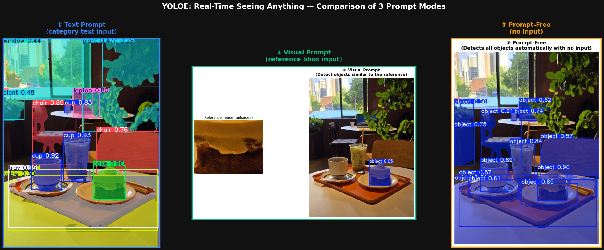

# YOLOE Reproduction

**YOLOE: Real-Time Seeing Anything** (Wang et al., ICCV 2025) 논문의 핵심 주장을 제한된 자원(공유 GPU 서버 1장 + Google Colab) 환경에서 재현하고, 그 과정과 결과를 정리한 저장소입니다.

- Contributors: Kim Jey, Shao Xiaoyue, Hong Seungbum, An Jiwoong


<p align="center">
  
</p>

<p align="center"><sub>YOLOE의 세 가지 프롬프트 모드(텍스트/비전/프롬프트-프리) 비교 — <code>code/table1_zero_shot_eval/table1_YOLOE_v2_demo.ipynb</code> 실행 결과</sub></p>

---

## 1. 문제 정의

기존 YOLO 계열 모델은 빠르지만 사전에 정의된 카테고리(예: COCO 80종)만 탐지할 수 있어 open-world 환경(신규 객체, 특수 도메인, 사용자 정의 쿼리)에 취약합니다. GLIP(텍스트 프롬프트), 비전 프롬프트 기반 모델, 프롬프트-프리 모델 등 open-set 방법이 존재하지만 각각 느린 크로스모달 연산, 무거운 Transformer, 대형 언어모델 의존이라는 비용을 수반합니다.

YOLOE는 **텍스트 / 비전 / 프롬프트-프리** 세 가지 프롬프트 방식을 하나의 효율적인 모델로 통합해, 추론·전이 시 추가 오버헤드 없이 open-vocabulary 탐지·분할을 수행하는 것을 목표로 합니다.

## 2. YOLOE 핵심 메커니즘 (요약)

| 모듈 | 프롬프트 방식 | 역할 |
|---|---|---|
| **RepRTA** (Re-parameterizable Region-Text Alignment) | 텍스트 | 사전학습된 텍스트 임베딩을 경량 보조 네트워크(Auxiliary Network)로 재정렬해, 이미지-텍스트 정합을 재파라미터화 가능한 형태로 학습 → 추론 시 보조 네트워크를 컨볼루션 커널에 흡수시켜 오버헤드 제거 |
| **SAVPE** (Semantic-Activated Visual Prompt Encoder) | 비전(박스/포인트) | Activation branch(프롬프트에 따라 달라지는 가중치)와 Semantic branch(프롬프트와 무관한 특징)를 분리해 집계, 적은 연산으로 비전 프롬프트 임베딩 생성 |
| **LRPC** (Lazy Region-Prompt Contrast) | 프롬프트-프리 | 대형 언어모델 없이, 내재된 대규모 vocabulary와 특화 임베딩으로 앵커를 먼저 필터링한 뒤 카테고리를 매칭 |

자세한 구조는 [`reference/README.md`](./reference/README.md)를 참고하세요.

## 3. 재현 실험 설계

논문의 핵심 주장(open-vocabulary 일반화)을 검증하기 위해 두 가지 실험을 재현했습니다.

| 실험 | 목적 | 데이터셋 |
|---|---|---|
| **Table 1 — Zero-shot evaluation** | 학습 없이 사전학습 모델을 LVIS minival(1,203 클래스)에서 평가, 논문의 open-vocabulary 주장을 직접 검증 | LVIS minival |
| **Table 4 — COCO Fine-tuning** | COCO 서브셋에서 Linear Probing(LP) → Full Fine-tuning(FT)으로 학습해 재현 실험에 실제 학습 과정을 포함 | Full COCO |

### 논문 vs 재현 환경(리소스 제약)

Table 1(제로샷 평가)과 Table 4(파인튜닝)는 실행 환경이 다릅니다 — 전자는 Google Colab, 후자는 공유 GPU 서버에서 진행했습니다.

| 항목 | Paper | Ours |
|---|---|---|
| 모델 | YOLOE-v8-S / YOLO-World-v2-S | 동일 |
| **[Table 1]** 평가셋 | LVIS minival (1,203 cats) | 동일 |
| **[Table 1]** 실행 환경 | TensorRT on T4 | Google Colab (A100) + PyTorch |
| **[Table 4]** 학습셋 | Full COCO | 동일 |
| **[Table 4]** LP / Full FT epoch | 10 / 160 | 10 / ~104(→160 재시도) |
| **[Table 4]** Batch size | 128 | 64(LP) / 16(FT), nbs=128 |
| **[Table 4]** 실행 환경 | 8x RTX 4090 | 1x RTX 4090 (공유 서버) |

GPU 8대 vs 1대, 배치·epoch 축소 등의 자원 제약으로 절대적인 AP 수치 차이는 예상된 결과이며, **재현의 초점은 논문이 보고한 경향성(directional trend)이 실제로 재현되는지**에 있습니다.

## 4. 결과

### 4.1 Table 1 — Zero-shot 평가 (LVIS minival)

| Model | AP | AP_r | AP_c | AP_f | FPS |
|---|---|---|---|---|---|
| YOLOE-v8-S (Paper) | 27.9 | 22.3 | 27.8 | 29.0 | 305.8 |
| **YOLOE-v8-S (Ours)** | **25.61** | 18.95 | 25.79 | 26.65 | 86.6 |
| YOLO-World-v2-S (Paper) | 24.4 | 17.1 | 22.5 | 27.3 | 216.4 |
| **YOLO-World-v2-S (Ours)** | **22.70** | 16.30 | 20.80 | 25.50 | 73.7 |

→ **YOLOE > YOLO-World 우위 순서는 재현됨.** 절대 AP·FPS 차이는 TensorRT(T4) vs PyTorch(Colab A100), 추론 임계값 등 평가 파이프라인 차이에서 기인한 것으로 추정됩니다.
원본 수치: [`results/table1_yoloe_fixed_ap.json`](./results/table1_yoloe_fixed_ap.json), [`results/table1_yoloe_fps_A100.json`](./results/table1_yoloe_fps_A100.json)

> Ultralytics `model.val()`을 그대로 쓰면 논문이 쓰는 LVIS **Fixed AP** 계산 로직이 반영되지 않아 AP가 크게 낮게 나옵니다. 예측 결과를 JSON으로 dump한 뒤 공식 `lvis.eval.LVISEval`로 직접 재평가해서 위 AP 25.61을 얻었습니다 — 평가 래퍼와 공식 API의 차이가 같은 모델·데이터셋에서도 결과를 크게 바꿀 수 있음을 보여주는 지점입니다.

### 4.2 Table 4 — COCO Fine-tuning

| Setting | Dataset | Epochs | Batch | APb | APb50 | APm | APm50 |
|---|---|---|---|---|---|---|---|
| Paper LP | Full COCO | 10 | 128 | 35.6 | 51.5 | 30.3 | 48.2 |
| Paper FT | Full COCO | 160 | 128 | 45.0 | 61.6 | 36.7 | 58.3 |
| **Ours LP** | Full COCO | 10 | 64 | **21.84** | 30.88 | 19.28 | 30.25 |
| **Ours FT** | Full COCO | 160 | 16 | **30.64** | 42.90 | 26.65 | 41.89 |

→ **"FT > LP" 경향은 재현됨.** 절대 수치 차이는 배치 크기(128 vs 16/64) 및 GPU 자원 차이로 설명됩니다. 학습 곡선을 epoch 단위로 살펴본 결과 **epoch 60 부근부터 과적합(overfitting)** 이 관찰되었습니다.
학습/평가 로그 원본: [`results/lp_fullcoco_val.txt`](./results/lp_fullcoco_val.txt), [`results/ft_fullcoco_val.txt`](./results/ft_fullcoco_val.txt)

## 5. 재현 과정에서 겪은 문제와 해결

| 문제 | 해결 |
|---|---|
| Ultralytics `model.val()`이 논문의 LVIS Fixed AP 로직을 반영하지 않아 YOLOE 평가 AP가 크게 낮게 나옴 | 예측을 JSON으로 dump 후 공식 `lvis.eval.LVISEval`로 재평가 → AP 25.61 재현 |
| YOLOE(Ultralytics)와 YOLO-World(MMDetection) 간 어노테이션 포맷 불일치 | `lvis_v1_minival.json`에 필요한 `file_name` 필드 추가 |
| Ultralytics의 YOLO-World 래퍼로 평가 시 AP 12.32로 논문 대비 크게 저조 | YOLO-World 공식 `tools/test.py`로 재평가 → AP 22.70 재현 |
| 자원 제약으로 배치/epoch/데이터셋 축소 시 FT 성능 저하 | GPU 여유가 생기는 시점에 배치·epoch·Full COCO로 스케일업해 AP 개선 확인 |
| 데이터셋 심볼릭 링크 깨짐 → 빈 라벨 캐시로 인한 오해성 학습 오류 | `readlink`로 심볼릭 링크 검증, 절대경로로 재생성, 캐시 삭제 후 재생성 |

## 6. 한계

- Full FT는 논문과 동일한 배치(128)·epoch(160)까지 완전히 수렴시키지 못함 (자원 제약으로 배치 16, ~104~160 epoch에서 종료)
- TensorRT 기준 FPS는 측정하지 못하고 PyTorch 추론 속도로 대체
- 평가 파이프라인(임계값 등) 설정이 논문과 완전히 일치하지 않아 절대 수치 비교에는 한계가 있음

**결론:** 모든 수치를 완벽히 재현하는 것이 아니라, 제한된 자원 안에서도 YOLOE의 효율성 지향 설계와 YOLO-World 대비 상대적 우위가 **경향성 수준에서 재현 가능함**을 확인하는 것이 이번 프로젝트의 핵심 성과입니다.

## 7. 저장소 구조

```
├── assets/                        README용 데모 이미지
├── code/
│   ├── table1_zero_shot_eval/     LVIS minival 제로샷 평가 노트북 (YOLOE, YOLO-World v1/v2)
│   └── table4_coco_finetune/      COCO 데이터 준비 → LP/FT 학습 → LP/FT 평가 스크립트
├── results/                       실제 실행 결과 (AP/FPS json, 학습·평가 로그)
└── reference/                     [보조] 공식 YOLOE 레포·논문 링크 및 핵심 개념 요약
```

### `code/table1_zero_shot_eval/` — Colab에서 실행

| 노트북 | 설명 | 바로 열기 |
|---|---|---|
| `table1_YOLOE_v2_demo.ipynb` | 공식 YOLOE 레포로 LVIS minival Fixed AP 계산, PyTorch FPS 측정, 텍스트/비전/프롬프트-프리 3가지 모드 데모 | [](https://colab.research.google.com/github/ajw522725/yoloe-reproduction/blob/main/code/table1_zero_shot_eval/table1_YOLOE_v2_demo.ipynb) |
| `table1_YOLOWorld_v1_AP.ipynb` | YOLO-World-v2-S LVIS minival AP 재현(공식 `tools/test.py` 경로) | [](https://colab.research.google.com/github/ajw522725/yoloe-reproduction/blob/main/code/table1_zero_shot_eval/table1_YOLOWorld_v1_AP.ipynb) |
| `table1_YOLOWorld_v2_FPSonly.ipynb` | YOLO-World FPS 단독 측정 | [](https://colab.research.google.com/github/ajw522725/yoloe-reproduction/blob/main/code/table1_zero_shot_eval/table1_YOLOWorld_v2_FPSonly.ipynb) |

노트북 셀 안의 `# Own Code`로 표시된 부분이 직접 작성한 코드이며, 그 외 셀은 공식 레포 설치·체크포인트 다운로드 등 실행 환경 구성입니다.

### `code/table4_coco_finetune/` — 공유 GPU 서버(1x RTX 4090)에서 실행

1. `01_prepare_dataset.py` — COCO annotation → YOLO detection/segmentation 라벨 및 dataset YAML 변환 (직접 작성)
2. `02_train_lp.py` / `03_train_ft.py` — Linear Probing / Full Fine-tuning 학습 (Ultralytics `YOLOE` 래퍼 호출)
3. `04_val_lp.py` / `05_val_ft.py` — 각 체크포인트 검증(Box/Mask AP)

실행 환경: Python 3.10, `ultralytics==8.3.39`, PyTorch 2.12 (CUDA 13.0), 1x RTX 4090. 예: 1단계 데이터 준비는 다음과 같이 실행합니다.

```bash
python "01_prepare_dataset.py" \
  --train_json annotations/instances_train2017.json \
  --val_json   annotations/instances_val2017.json \
  --train_img_root images/train2017 \
  --val_img_root   images/val2017 \
  --det_out_dir datasets/coco_full_yolo_det \
  --seg_out_dir datasets/coco_full_yolo_seg \
  --max_train 0 --max_val 0 \
  --copy_mode symlink
```

> 스크립트 내 경로(`/home/gaya7/dsc3032-gaya-shared/...`)는 공유 GPU 서버 기준이며, 재현 시 본인 환경에 맞게 수정이 필요합니다.

## 8. 참고

- 논문: [YOLOE: Real-Time Seeing Anything (arXiv:2503.07465)](https://arxiv.org/abs/2503.07465)
- 공식 구현: [THU-MIG/yoloe](https://github.com/THU-MIG/yoloe) — 이 레포에는 원본 코드를 포함하지 않으며, 개념 설명은 [`reference/README.md`](./reference/README.md) 참고
